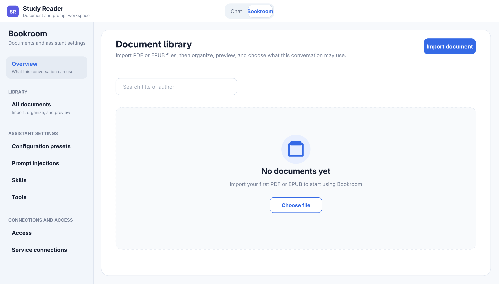

# DSH Study Reader

[简体中文](README.zh-CN.md)

DSH Study Reader is a PDF/EPUB workspace for DeepSeek Harness. It organizes, extracts, and previews documents while providing clearly scoped evidence for document-grounded conversations.



_Illustrative empty state with no real documents or user data._

## Features

- Persistent PDF/EPUB library with folders.
- Original-document and MinerU structured previews without saved reading positions, with ZIP export of extraction results.
- Conversation-scoped document access that keeps unrelated content out of context.
- Loopback-only MCP access for Codex and other clients, limited to documents selected in the browser.
- Reusable presets combining prompt injections, Skills, and Tools.
- Per-folder new-conversation defaults for the currently selected documents and Reader configuration.
- Official MinerU cloud and compatible local Docker services.
- English and Simplified Chinese UI that follows the DSH locale.

## Requirements

- A current DeepSeek Harness source checkout and the Node.js and pnpm versions it supports.
- A MinerU API key for cloud PDF extraction, or a compatible local Docker service. EPUB extraction is always local.

## Installation

Clone the plugin inside the DeepSeek Harness repository root, then run the one-command installer:

```bash
cd /absolute/path/to/deepseek-harness
git clone git@github.com:Qqiutand/dsh-study-reader.git
cd dsh-study-reader
pnpm run install:dsh -- --dsh-home "$HOME/.dsh"
```

It installs dependencies, builds and verifies the `.tgz`, adds the plugin to the
`web` profile, and installs the bundled `reading` agent preset into the same
DSH home. Restart `pnpm dsh web` afterwards.

If the plugin is not a direct child of the Harness root, pass that path explicitly:

```bash
pnpm run install:dsh -- \
  --dsh-home "$HOME/.dsh" \
  --harness-root "/absolute/path/to/deepseek-harness"
```

## Configuration

- Open **Bookroom → Service connections** to configure a MinerU API key or local Docker service.
- Open **Bookroom → Configuration presets** to combine prompt injections, Skills, and Tools.
- Add only the documents you need to the current conversation; previewing a document does not grant access.
- On **Bookroom → Overview**, use **Set as Workspace default** to copy the current document grants and Reader configuration into future top-level conversations created in the same folder. Each conversation imports the snapshot once and can then be changed independently; existing conversations and forks are not modified.
- The UI follows the DSH locale immediately; document titles and user-authored content keep their original language.

For a complex one-off task, enter:

```text
/reader-unbounded <task>
```

It removes Reader tool-call count limits for that task only; the next ordinary
message automatically returns to the bounded policy. Document grants, explicit
write authorization, per-call timeouts, and exact duplicate-call protection stay active.

### External AI access (MCP)

Open **Bookroom → External AI access** and create a client authorization. One
authorization consists of the local MCP URL plus one bearer token; that token is
the security boundary for every reading set placed under it. Create another
authorization when a client needs independently scoped, expiring, or revocable
access. Keep `pnpm dsh web` running while an external client uses the Reader.

For Codex, add the complete generated block to `~/.codex/config.toml` and
restart Codex. The configuration carries the bearer token directly, so it does
not require `.bashrc`, an environment variable, or `codex mcp login` (which is
for OAuth):

```toml
[mcp_servers.study-reader]
url = "http://127.0.0.1:PORT/study-reader/mcp"
http_headers = { Authorization = "Bearer <BEARER_TOKEN>" }
```

Antigravity can connect directly to the same Streamable HTTP endpoint. Add the
generated block to `~/.gemini/config/mcp_config.json` or the workspace-local
`.agents/mcp_config.json`:

```json
{
  "mcpServers": {
    "study-reader": {
      "serverUrl": "http://127.0.0.1:PORT/study-reader/mcp",
      "headers": {
        "Authorization": "Bearer <BEARER_TOKEN>"
      }
    }
  }
}
```

Codex and Antigravity may use the same authorization at the same time. The
browser displays the token and both complete configurations in plaintext; use
**View configuration** on any active authorization to reopen them without
rotating the token.

Inside an authorization, create named reading sets from the whole library,
uncategorized documents, a library folder, or the current conversation. Sets can
be edited, copied, and deleted in the browser without changing the token or any
client configuration.

The connection exposes `reader_list_sets` plus `reader_get_context`,
`reader_list_documents`, `reader_get_outline`, `reader_search_passages`, and
`reader_read_passage`. The first tool returns each set's display name, document
count, and short opaque `setRef`. A `setRef` is a runtime selector, not another
credential or environment variable. Reader calls may omit it while only one set
exists; with multiple sets they must pass the chosen value. Document and passage
references cannot be reused across sets.

The external MCP server has no per-turn or per-session Reader call-count budget.
Per-call result sizes, timeouts, authorization, and opaque-reference boundaries
still apply, and Codex can retain its own session, context, or usage limits.
DSH presets, Skills, conversation memory, imports, deletion, and note writes
remain inside DSH and are not exposed through MCP.

## Local development

```bash
pnpm run typecheck
pnpm test
pnpm run build
```

You can also load the source patch directly from the Harness repository root without installing a `.tgz`:

```bash
pnpm dsh web --patch "/absolute/path/to/dsh-study-reader/cordis.patch.yml"
```

## Security boundaries

- Imported text is untrusted evidence and is never treated as system instructions.
- The immutable safety baseline remains active and cannot be disabled by presets.
- MinerU credentials are stored by the Harness Credential Service and are not returned to the browser.
- Document access is isolated to the current conversation.
- External MCP is loopback-only. Tokens are shown only when created, are not stored in grant records, expire automatically, and can be revoked from the browser.

## License

MIT
