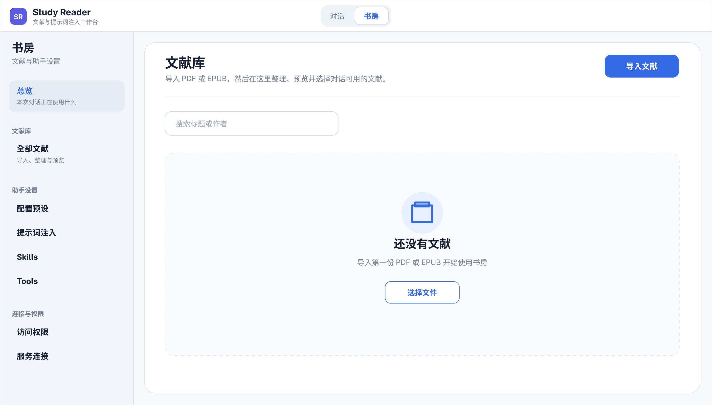

# DSH Study Reader

[English](README.md)

DSH Study Reader 是 DeepSeek Harness 的 PDF/EPUB 文献工作区，用于整理、解析和预览文献，并为对话提供范围明确的文献证据。



_空白状态示意图，不包含真实文献或用户数据。_

## 功能

- 持久化文献库与文件夹管理，支持 PDF 和 EPUB。
- 预览原文件和 MinerU 结构化内容（不记录阅读位置），并将识别结果导出为 ZIP。
- 按当前对话授权文献，避免无关内容进入上下文。
- 将提示词注入、Skills 和 Tools 保存为可复用的配置预设。
- 支持 MinerU 官方云端和兼容的本地 Docker 服务。
- 界面跟随 DSH 在简体中文与英文之间切换。

## 环境要求

- 最新的 DeepSeek Harness 源码工作区，以及该版本支持的 Node.js 和 pnpm。
- 云端解析 PDF 时需要 MinerU API Key；也可改用兼容的本地 Docker 服务。EPUB 始终在本地解析。

## 安装

把插件 clone 到 DeepSeek Harness 仓库根目录内，然后运行一键安装命令：

```bash
cd /你的绝对路径/deepseek-harness
git clone git@github.com:Qqiutand/dsh-study-reader.git
cd dsh-study-reader
pnpm run install:dsh -- --dsh-home "$HOME/.dsh"
```

它会安装依赖、构建并验证 `.tgz`、把插件安装到 `web` profile，再把自带的
`reading` Agent 预设安装到同一个 DSH home。完成后重新启动 `pnpm dsh web`。

如果插件不是 Harness 根目录的直接子目录，可显式指定 Harness 路径：

```bash
pnpm run install:dsh -- \
  --dsh-home "$HOME/.dsh" \
  --harness-root "/你的绝对路径/deepseek-harness"
```

## 配置

- 在 **书房 → 服务连接** 中配置 MinerU API Key 或本地 Docker 服务。
- 在 **书房 → 配置预设** 中组合提示词注入、Skills 和 Tools。
- 在书房中将需要的文献加入本次对话；预览文献不会自动授权。
- 界面语言实时跟随 DSH；文献标题和用户内容保持原语言。

## 本地开发

```bash
pnpm run typecheck
pnpm test
pnpm run build
```

也可以从 Harness 仓库根目录直接加载源码 patch，无需安装 `.tgz`：

```bash
pnpm dsh web --patch "/你的绝对路径/dsh-study-reader/cordis.patch.yml"
```

## 安全边界

- 导入的正文是不可信证据，不会被当作系统指令。
- 不可变安全基线始终生效，不能被配置预设关闭。
- 密钥由 Harness Credential Service 保存，不会返回浏览器。
- 文献访问权限按当前对话隔离。

## 许可证

MIT
